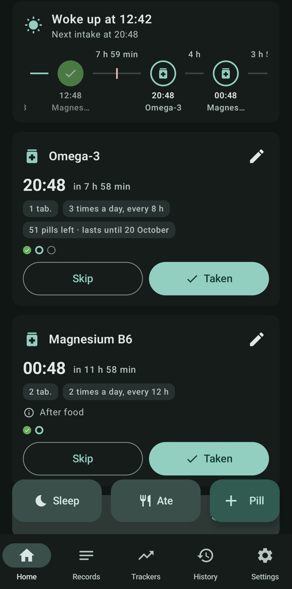
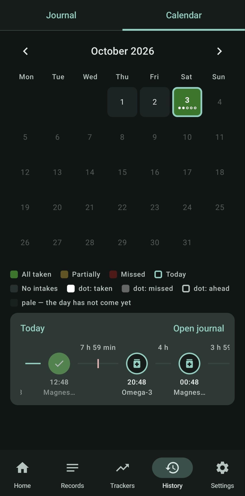

# DoseDay

<p align="center">
  <a href="https://github.com/brano-san/PillReminder/releases/latest">
    
  </a>
</p>

<p align="center">
  <a href="https://github.com/brano-san/PillReminder/releases/latest"></a>
  <a href="https://github.com/brano-san/PillReminder/actions/workflows/android.yml"></a>
  <a href="LICENSE"></a>
  
</p>

## A lightweight pill reminder for Android

**DoseDay is a pill reminder that plans your day around when you actually wake up,
not around the clock.** Press "I woke up" and every intake is counted from that
moment; press "Taken" and the next dose is counted from the real time you took it.
Go to bed at 3 a.m. or get up at noon — the schedule follows you instead of
nagging you at the wrong time.

<p align="center">
  
  &nbsp;&nbsp;&nbsp;
  
</p>

## Private by design

DoseDay has no account, no ads and no analytics. Your schedule, history and notes stay on your phone:
the only network request is a daily check of GitHub for a new version, and it
can be turned off in Settings → Updates.
Backups are plain files you export and keep yourself. An optional app lock
(fingerprint or device PIN) and a private mode hide what you take from the lock
screen, the widget and anyone looking over your shoulder.

## Free and open source

DoseDay is free and open source under the [MIT license](LICENSE).

## What it can do

- **Flexible schedules** — from wake-up, at exact clock times, on chosen days of the week, as a fixed course or as needed.
- **Food rules** — "after a meal" intakes wait for the "Ate" button; "before a meal" and "keep apart from" rules are respected.
- **Reliable reminders** — repeats, snooze, quiet hours, grouped notifications and a full-screen alarm.
- **Stock and courses** — remaining pills, a "lasts until" forecast, course countdown and an archive of finished courses.
- **Trackers** — weight with BMI, mood and sleep, with charts and correlations.
- **History** — day journal, adherence calendar, streaks and a doctor report in TXT and PDF.
- **Notes and visits** — doctor visits with reminders, notes linked to pills, a medication catalog with package photos.
- **Widgets, themes and languages** — two home-screen widgets, light and dark themes, English and Russian.

## Getting the app

### Download

Signed APKs for every version are on the
[releases page](https://github.com/brano-san/PillReminder/releases/latest).
Download `DoseDay-<version>-release.apk` on your phone and install it
(Android 8.0 or newer; allow installing from your browser when asked).

### Building from source

You need JDK 17 and the Android SDK (API 35).

```bash
git clone https://github.com/brano-san/PillReminder.git
cd PillReminder
./gradlew assembleDebug
```

The APK appears in `app/build/outputs/apk/debug/`. Release builds are signed
when a `keystore.properties` file is present next to the project; without it
Gradle produces an unsigned release APK.

## Releases

Every push and pull request is built and unit-tested by
[GitHub Actions](https://github.com/brano-san/PillReminder/actions).
Pushing a `v*` tag builds a signed APK and publishes it as a GitHub release.

## Documentation

- [FEATURES.md](FEATURES.md) — the full list of features, for manual testing (Russian).
- [CLAUDE.md](CLAUDE.md) — project invariants to keep in mind when changing the code (Russian).
- [doc/](doc) — plans, reviews and bug analyses for each version (Russian).
- What's new — in the app: Settings → What's new.
